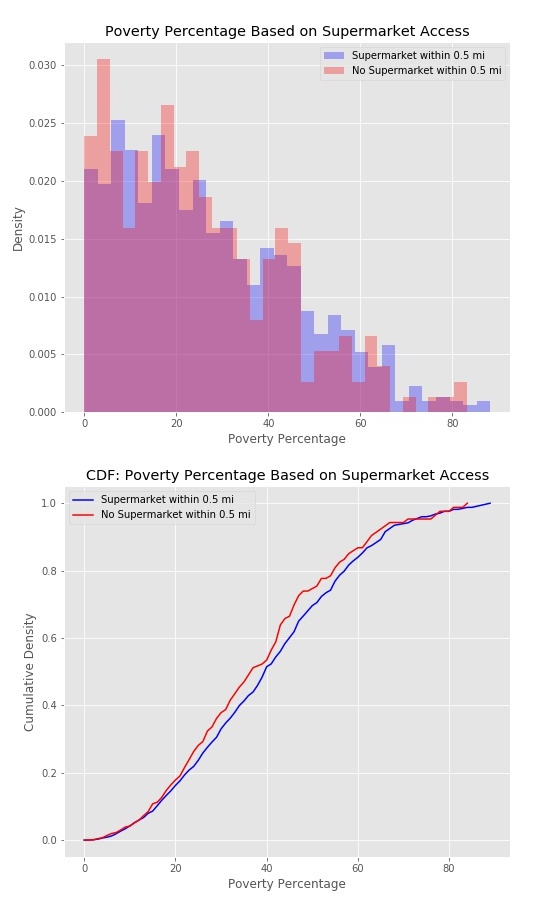

# Philly Neighborhood Food Access Exploration
Galvanize DSI Capstone #1: An Analysis on Food Access in Philadelphia

## Overview
This project will explore whether poverty levels impact access to healthy food stores in the city of Philadelphia.  The dataset for this evaluation comes from OpenDataPhilly.org, and the details of the collection methodology can be found in the Technical Appendix.

## Background 


1. Dataset: https://www.opendataphilly.org/dataset/showcases/neighborhood-food-retail

1. Technical Appendix:
http://foodfitphilly.org/wp-content/uploads/2019/08/Technical-Appendix.pdf

Food access data was collected at each unique census GEOID10 within the Greater Philadlephia area, where the most specific unit was the Block Group.  Each Block Group represents a certain number of residents within a geographic location.  The data collected for each Block Group is shown in the list below: 

* GeoID: census id (unique identifier)
* Non Residential (Y/N): indicates non-residential areas
* Total Low Produce Supply Stores
* Low Produce Supply Stores per 1000 Residents
* Total High Produce Supply Stores
* High Produce Supply Stores per 1000 Residents
* Percent High Produce Supply Stores
* Supermarket Access (Y/N): based on 0.5 mile radius
* Total Restaurants: within GeoID
* Percent Poverty: percent of residents that fall below the Federal Poverty Line
* Percent Vehicle Availability
* Area: of GeoID

### Definitions:  
* **High Produce Supply Store (HPSS)**: Stores that carry a certain amount of fresh fruits and vegetables   
   * *Ex: typical supermarkets*
* **Low Produce Supply stores (LPSS)**: stores that carry little to no fresh fruits or vegetables.  
  * *Ex: gas stations and corner stores* 
* **Percent HPSS**:  HPSS / (HPSS + LPSS)


## Questions to Explore

1. Is there a difference in poverty levels between areas that have access to a supermarket and areas that do not have access to a supermarket? 
    * "Access" means there is a supermarket within 0.5 miles walking distance.

1. Is there a difference in vehicle availability between areas that have access to supermarkets and those that do not? 

1. Is there a difference in the number of high produce supply stores based on poverty classification? 
    * High poverty classified as >20% of the residents falling below the Federal Poverty Line

1. Is there a difference in the number of low produce supply stores based on poverty classification? 

## Exploratory Data Analysis

### Initial Exploration: 

The dataset has 1336 entries and 17 columns.

**Null Values:**
There were 13 null values within the raw dataset, 11 of which corresponded to the non-residential areas within Philadelphia. These null values were excluded, as I was interested in the areas with residents.  These records can be found Initial_exploration.ipynb file.  

**Initial Findings and Methodology** 

*Supermarket Access:*



#TODO: talk about how we will further explore this with hypothesis testing


*Poverty Levels and Food Access*
The dataset was split into two categories: High Poverty and Not High Poverty.  High Poverty areas are those in which greater than 20% of residents fell below the Federal Poverty Line.


## Hypothesis Testing

1. Is there a difference in vehicle access between areas with supermarket access and those without supermarket access? 

    Null Hypothesis: H<sub>0

    >The mean vehicle availability for areas with supermarket access is the same as the mean vehicle availability for areas without supermarket access.


    Alternative Hypothesis: H<sub>A

    >The mean vehicle availability in areas WITH supermarket access is different than the mean vehicle availability in areas WITHOUT supermarket access.

    Significance Level (alpha) = 0.05
    >Assumptions: two independent samples with unequal variance. Perform Welche's two sample t-test. 

    **Results**
    
    Statistically, areas without supermarket access have a higher vehicle availability.  Practically speaking, however, the difference in sample means of 5% is not that interesting.
    ``` 
    Difference in Sample Means: 5.16 %
        p-value: 0.0002
        Statistical Conclusion: reject the null hypothesis