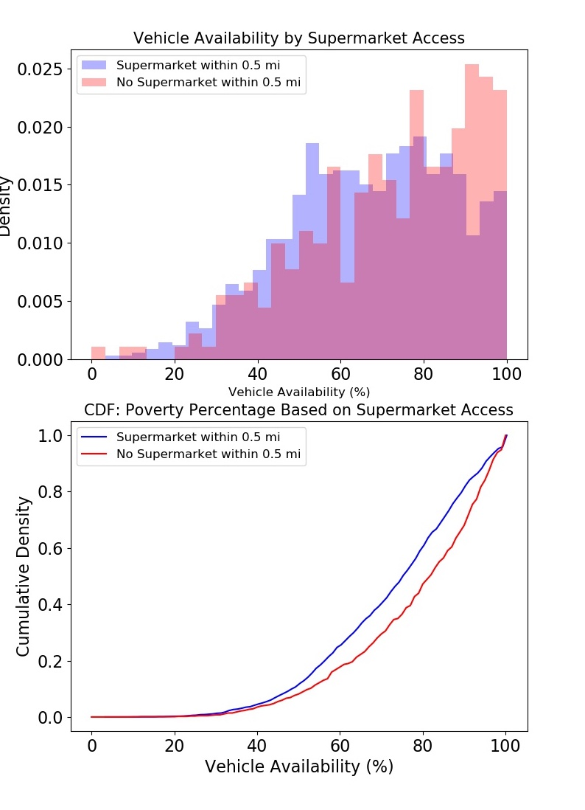
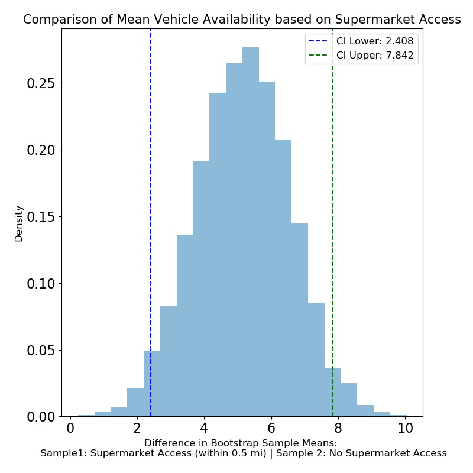

# Philly Neighborhood Food Access Exploration

This project will explore whether there are any relationships between food access in Philadelphia and socioeconomic factors such as poverty level and vehicle availability. The dataset used in this evaluation comes from OpenDataPhilly.org.

## About the Dataset

Food retail data was collected for unique Census Block Groups within Philadelphia. Each Block Group represents a certain number of residents within a geographic location.  

The main attributes on which I focused my analysis are listed below:

* Total Number of High and Low Produce Supply Stores
* Proportion of High Produce Supply Stores
* Supermarket Access (Y/N): based on 0.5 mile radius
* Percent Poverty: percent of residents that fall below the Federal Poverty Line at the time of collection
* Vehicle Availability

### Definitions:  
* **High Produce Supply Stores (HPSS)**: Stores that carry a certain amount of fresh fruits and vegetables   
   * *Ex: typical supermarkets*
* **Low Produce Supply Stores (LPSS)**: stores that carry little to no fresh fruits or vegetables.  
  * *Ex: gas stations and corner stores* 
* **Percent HPSS**:  HPSS / (HPSS + LPSS)


---

## Investigations
1. Is there a difference in vehicle availability between areas that have access to supermarkets and those that do not?

1. Is there a difference in the percentage of high produce supply stores based on poverty classification? 

---

## Exploratory Data Analysis

### **Initial Exploration**

The raw dataset had 1336 entries and 17 columns.

**Null Values:**
There were 13 null values within the raw dataset, 11 of which corresponded to the non-residential areas within Philadelphia. These null values were excluded, as I was interested in the areas with residents. 

### Visualizations

The data for total number of low produce supply stores by poverty classification indicated that high poverty areas could be more likely to have more low produce supply stores (i.e. corner stores, gas stations).  

<p align="center">
    
</p>

### Modeling Exploration: Total LPSS

I thought that total LPSS might follow a Poisson distribution, where the unit of space was the Census Block Group and each "event" was the presence of an LPSS. 

**Maximum Likelihood Approach:**
* Poisson model to converge on the variable lambda, approximated by the sample means

    ```
    * Mean(High Poverty Areas) = 33.86
    * Mean(Not High Poverty Areas) = 24.4
    ```

The figure below clearly shows that the data were not generated by a Poisson distribution.

<p align="center">
    
</p>

**Potential Explanations**

It's likely that our Block Groups are not identically distributed with respect to LPSS; it's more likely that each subsection of Philadlephia has specific demands for the food retail scene. It is interesting that the three areas with the highest number of low produce supply stores are those which likely draw the most non-residents (students and commuters).


---

### **Analysis 1:** Supermarket Access and Vehicle Availability

<p align="center">
    
</p>

**Further Exploration:** Is there a difference in the mean vehicle access between areas with supermarket access and areas without supermarket access?

Methodology: comparison of means

* Relied on boostrapping in order to create a normal distribution of the differences in means between groups (supermarket - no supermarket)
* Number of bootstrap samples = 5,000
* Calculated the 95% confidence interval for the difference in means using the 2.5 and 97.5 percentiles of the distribution of the mean differences


**Conclusion**: Vehicle availability appears to be **higher** in areas **without supermarket access**.  We are 95% confident that the difference in mean vehicle availability is between 2.51% and 7.85%. 

<p align="center">
    
</p>

---

### **Analysis 2:** Poverty Levels and Food Access

The dataset was split into two categories: High Poverty and Not High Poverty.  High Poverty areas are those in which greater than 20% of residents fell below the Federal Poverty Line.

<p align="center">
    
</p>


**Further Exploration:** Is there a difference in HPSS percentage in High Poverty areas vs. Not High Poverty areas?

Methodology: Comparison of Medians

* Compared medians of the two groups due to right-skewedness 
* Relied on boostrapping in order to create a normal distribution of the differences in medians (high poverty - not high poverty)
* Calculated the 95% confidence interval for the difference in medians using the 2.5 and 97.5 percentiles of the distribution of the median differences

**Conclusion:** Areas with **poverty levels above 20%** appear to have a **lower percentage of HPSS stores** than areas with poverty levels above 20%.  We are 95% confident that the percentage of HPSS in high poverty areas is between 3.64% and XX 6.35% lower than non-high poverty areas. 


<p align="center">
    
</p>

---
## Supporting Information / Appendix

### Supporting Code
/src/hypo_testing_supermarket.py
/src/hypo_testing_pct_hpss_by_poverty.py
/src/functionalization.py
/notebooks/Exploratory_Data_Analysis.ipynb

### Summary Statistics

Table 1: Vehicle Availability (%) by Supermarket Access
|Group   | Mean | Standard Deviation | n |
|--------|------|--------------------|---|
Supermarket Access | 66.94 |19.76| 1051|
No Supermarket Access  |72.09 |20.50| 272|


Table 2: HPSS Proportion (%) by Poverty Classification
|Group   | Mean | Median  | Standard Deviation | n |
|--------|------|---------|--------------------|---|
High Poverty | 9.41 | 7.90| 6.84 | 739|
Not High Poverty| 14.87 |  12.5 | 11.53 | 584|


### Hypothesis Testing

1. **Is there a difference in vehicle access between areas with supermarket access and those without supermarket access?**

    Null Hypothesis: H<sub>0

    >The mean vehicle availability for areas with supermarket access is the same as the mean vehicle availability for areas without supermarket access (difference in means = 0).


    Alternative Hypothesis: H<sub>A

    >The mean vehicle availability in areas with supermarket access is different than the mean vehicle availability in areas without supermarket access (differenc in means != 0).

    Significance Level (alpha) = 0.05

    Methodology
    > 5,000 bootstrap samples from each group
    
    > The the size of each boostrap sample was equal to the number of samples within each group and were chosen at random and with replacement

    >Calculated the mean of each bootstrap sample and then the difference in means between each group

    >Calculated 95% confidence intervals as the 2.5 and 97.5 percentiles of the mean differences


1. **Is there a difference in the HPSS percentage in High Poverty areas vs. Not High Poverty areas?**

    Null Hypothesis: H<sub>0

    >The median percent HPSS within high poverty areas is the same as the percent HPSS within areas that are not classified as high poverty (differences in median = 0)

    Alternative Hypothesis: H<sub>A

    >The median percent HPSS within high poverty areas is different than the percent HPSS within areas that are not classified as high poverty (differences in median != 0)

    Significance Level (alpha) = 0.05

    Methodology
    > 5,000 bootstrap samples from each group
    
    > The the size of each boostrap sample was equal to the number of samples within each group and were chosen at random and with replacement

    >Calculated the median of each bootstrap sample and then the difference in means between each group

    >Calculated 95% confidence intervals as the 2.5 and 97.5 percentiles of the mean differences
    
  ###Sources
  
  1. Dataset: https://www.opendataphilly.org/dataset/showcases/neighborhood-food-retail

  1. Technical Appendix: http://foodfitphilly.org/wp-content/uploads/2019/08/Technical-Appendix.pdf
