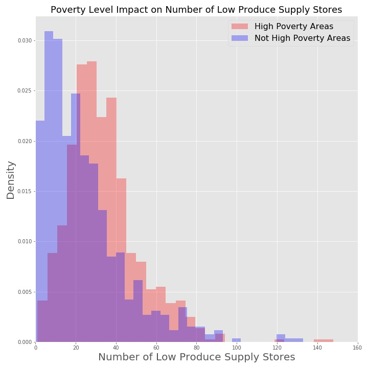
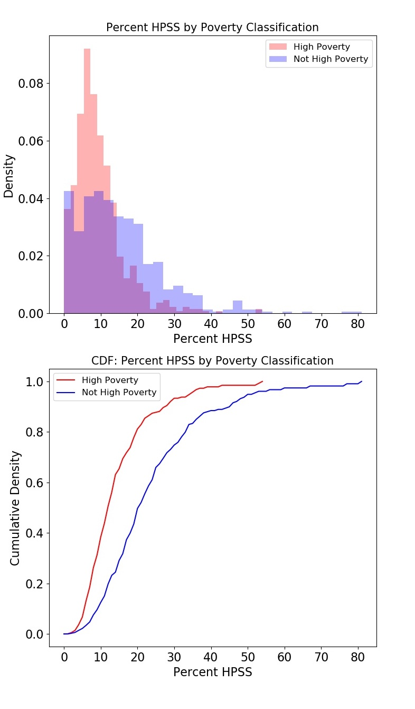

# Philly Neighborhood Food Access Exploration
Galvanize DSI Capstone #1: An Analysis on Food Access in Philadelphia

## Overview
This project will explore whether poverty levels impact access to healthy food stores in the city of Philadelphia.  The dataset for this evaluation comes from OpenDataPhilly.org, and the details of the collection methodology can be found in the Technical Appendix.

## Background 


1. Dataset: https://www.opendataphilly.org/dataset/showcases/neighborhood-food-retail

1. Technical Appendix:
http://foodfitphilly.org/wp-content/uploads/2019/08/Technical-Appendix.pdf

Food access data was collected at each unique census GEOID12 within the Greater Philadlephia area, where the most specific unit was the Block Group.  Each Block Group represents a certain number of residents within a geographic location.  The most attributes I chose to focus my analysis are listed below:

* Total Number of Low Produce Supply Stores
* Total Number of High Produce Supply Stores
* Percent High Produce Supply Stores
* Supermarket Access (Y/N): based on 0.5 mile radius
* Percent Poverty: percent of residents that fall below the Federal Poverty Line
* Percent Vehicle Availability

### Definitions:  
* **High Produce Supply Store (HPSS)**: Stores that carry a certain amount of fresh fruits and vegetables   
   * *Ex: typical supermarkets*
* **Low Produce Supply stores (LPSS)**: stores that carry little to no fresh fruits or vegetables.  
  * *Ex: gas stations and corner stores* 
* **Percent HPSS**:  HPSS / (HPSS + LPSS)


---

## Questions to Explore

1. Is there a difference in mean poverty level between areas that have access to a supermarket and areas that do not have access to a supermarket? 
    * "Access" = there is a supermarket within 0.5 miles walking distance

1. Is there a difference in the mean vehicle availability between areas that have access to supermarkets and those that do not?

1. Is there a difference in the mean number of high produce supply stores based on poverty classification? 
    * High poverty: >20% of the residents' incomes fall below the Federal Poverty Line

1. Is there a difference in the mean number of low produce supply stores based on poverty classification? 

---

## Exploratory Data Analysis

### Initial Exploration: 

The dataset has 1336 entries and 17 columns.

**Null Values:**
There were 13 null values within the raw dataset, 11 of which corresponded to the non-residential areas within Philadelphia. These null values were excluded, as I was interested in the areas with residents. 

**Initial Visualizations**

I intially spent a lot of time visualizing the data through scatterplot matrices, overlaid histograms, and cumulative distributions before diving into any analysis.

The data for total number of low produce supply stores by poverty classification was interesting, as it indicated that high poverty areas could be more likely to have more low produce supply stores (i.e. stores that do not sell fruits and vegetables).  



***Modeling Exploration: Total LPSS***

I thought that total LPSS might follow a Poisson distribution, where the unit of space was the Census Block Group and each "event" was the presence of an LPSS.   

Maximum Likelihood Approach: 
* Poisson model to converge on the variable lambda, approximated by the sample mean

    ```
    * Mean(High Poverty Areas) = 33.86
    * Mean(Not High Poverty Areas) = 24.4
    ```

The figure below clearly shows that the data were not generated by a Poisson distribution.


*So what might be going on?*

It's likely that our samples are not independent and identically distributed because each subsection of Philadlephia has its own demands for high and low produce supply stores.  

#TODO ADD TITLE TO HEAT MAP AND LEGEND


---

### ***Analysis of Supermarket Access and Vehicle Availability***


**Further Exploration: Is there a difference in the mean vehicle access between areas with supermarket access and areas without supermarket access?**

Methodology: comparison of means

* Relied on boostrapping because distributions were not normal
* For each bootstrap sample, I plotted the difference in means (supermarket - no supermarket)
* Calculated the 95% confidents interval for the difference in means (see dashed lines at the 2.5 and 97.5 percentiles)


***Conclusion**: Vehicle availability is **higher** in areas **without supermarket access**.  The difference in mean vehicle availability is between 2.51% and 7.85%, based on a confidence level of 95%*


---

### ***Analysis: Poverty Levels and Food Access***

The dataset was split into two categories: High Poverty and Not High Poverty.  High Poverty areas are those in which greater than 20% of residents fell below the Federal Poverty Line.



**Further Exploration: Is there a difference in HPSS percentage in High Poverty areas vs. Not High Poverty areas?**

Methodology: comparison of medians

* Compared medians instead of means due to presence of several outliers (right-skewed)
* Relied on boostrapping because distributions were not normal
* For each bootstrap sample, I plotted the difference in medians (high poverty - not high poverty)
* Calculated the 95% confidents interval for the difference in medians (see dashed lines at the 2.5 and 97.5 percentiles)

*Conclusion: Areas with poverty levels above 20% have a lower percentage of HPSS stores than areas with poverty levels above 20% (with 95% confidence)*


---
# Supporting Information / Appendix
## Hypothesis Testing

1. Is there a difference in vehicle access between areas with supermarket access and those without supermarket access? 

    Null Hypothesis: H<sub>0

    >The mean vehicle availability for areas with supermarket access is the same as the mean vehicle availability for areas without supermarket access.


    Alternative Hypothesis: H<sub>A

    >The mean vehicle availability in areas WITH supermarket access is different than the mean vehicle availability in areas WITHOUT supermarket access.

    Significance Level (alpha) = 0.05
  